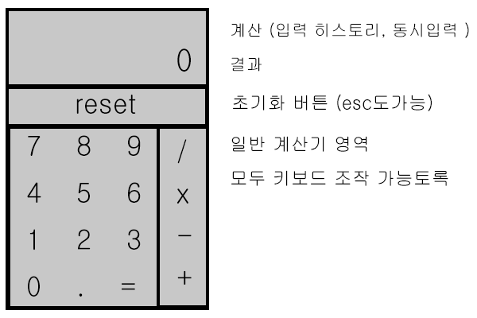

# 2019.03 과제
## 간단한 웹 계산기 만들기

> 언제든지 활용할 수 있는 간단한 웹 계산기를 만듭니다.  

###절대규칙 (중요)
1. 모든 기능은 키보드로 조작이 가능해야한다.  
2. 모바일 해상도도 지원 가능해야한다. 
- (계산기 자체 사이즈를 320px이하로 해도 무방, 디바이스 상관없이 사용가능토록만 제작)
3. 디자인(스타일)은 자유롭게 하되, 레이아웃(버튼 배치)은 아래와 동일하게 작업한다.

***

  
  

***

__과제에 대한 자세한 설명은 업데이트 중__
  
  