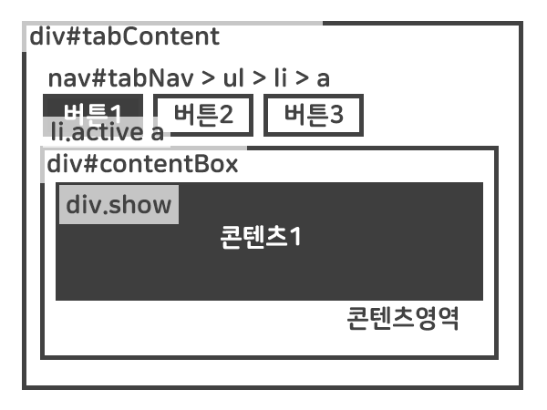

# 2019.03 a과제
## 탭 UI 제작

> 웹에 자주 사용되는 Tab UI를 제작합니다.

### RULE
1. HTML마크업은 아래 예시 코드를 사용한다. (코드 비교 수월)
2. 디자인(CSS)은 자유롭게 하되, 레이아웃 아래와 동일하게 작업한다.

***

```html
<div id="tabContent">
    <nav id="tabNav">
        <ul>
            <li class="active"><a href="#tabCont01">button01</a></li>
            <li><a href="#tabCont02">button02</a></li>
            <li><a href="#tabCont03">button03</a></li>
        </ul>
    </nav>
    <div id="contentBox">
        <div id="tabCont01" class="show">content01</div>
        <div id="tabCont02">content02</div>
        <div id="tabCont03">content03</div>
    </div>
</div>
```

  

***

__과제에 대한 자세한 설명은 업데이트 중__
  
