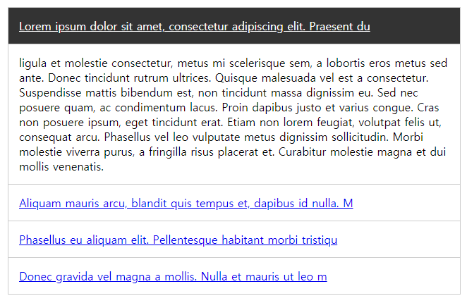

# 2019.03 b과제
## 로또번호 생성기

> 1 ~ 46개의 숫자 중 6가지 숫자를 랜덤으로 그룹핑하여 화면에 노출합니다.

### RULE
1. **완료기한 > 2019.03.20**
2. HTML, CSS는 아래 예시 코드를 사용한다. (코드 비교 수월)  
3. 행운의 번호 생성하기 버튼을 클릭하면 1 ~ 46 숫자 중 랜덤으로 6개의 숫자가 li에 담겨 화면에 노출된다.  
4. 노출형태(HTML)는 아래 예제코드 "<li>..</li>" 참고
5. 1개의 그룹 (6개의 숫자) 내 같은 숫자가 존재할 수 없고,  
  매 그룹 생성 시 마다 배열 > 배열 형태로 담는다. (아래 예시 참고)
6. 매 버튼 클릭 > 리스트 추가할때마다 앞에 넘버 +1 
7. 초기 버전은 많이 허술한 형태가 맞으니 위 조건만 충족하여 작업

***

```javascript
//RULE 4번에 대한 예시 설명
//1개의 그룹(6개의 숫자묶음) 생성 시 마다 그 그룹을 배열에 담고, 그 배열을 배열에 담는다.
//ex > 5개의 숫자 그룹을 생성시 
var finNumberGroups = [
    [1, 2, 3, 4, 5, 6],
    [2, 3, 4, 5, 6, 7],
    [12, 32, 23, 44, 45, 46],
    [4, 12, 11, 40, 41, 46],
    [1, 2, 23, 42, 34, 44]
];
```

***

```html
<style>
* {margin:0; padding:0;}
ul, li {list-style:none;}
#randomNumberBox {margin:0 auto; padding:0 20px; width:100%; max-width:360px; text-align:center; border:4px solid #ccc; box-sizing:border-box;}
#randomNumberBox h1 {margin:20px 0; letter-spacing:-2px;}
#randomNumberBox p {margin:0 0 20px; letter-spacing:-1px;}
#randomNumberBox .btnMakeNumber {display:block; margin-bottom:20px; width:100%; height:50px; letter-spacing:-1px; font-size:24px;}
#randomNumberBox .numberList li strong {font-size:18px;}
</style>
<div id="randomNumberBox">
    <h1>로또 번호 추출기</h1>
    <p>1부터 45까지의 숫자 중 <br>6개의 행운의 숫자를 추출합니다.</p>
    <button type="button" class="btnMakeNumber">행운의 번호 생성하기</button>
    <ul class="numberList">
        <!-- 
            여기에 생성된 번호가 아래의 양식으로 출력된다.
            <li>1. <strong>5</strong>, <strong>6</strong>, <strong>7</strong>, <strong>8</strong>, <strong>22</strong>, <strong>45</strong></li>
            <li>2. <strong>4</strong>, <strong>2</strong>, <strong>6</strong>, <strong>45</strong>, <strong>23</strong>, <strong>46</strong></li>
        -->
    </ul>
</div>
```

  
**동일페이지 내 재사용 구현을 위하여 우선 이미지내 id값 > class로 변경

***

__과제에 대한 자세한 설명은 업데이트 중__
  
