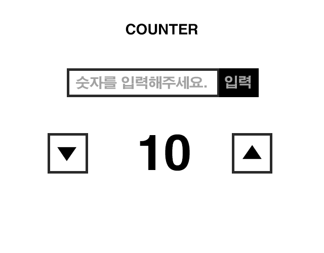

# 2019.04 a과제
## 카운터

> 카운터 1차 > down 또는 up버튼을 클릭 또는 직접 입력하여 숫자를 컨트롤 합니다. (쇼핑몰 장바구니 수량)

### RULE
1. **완료기한 > 2019.04.14**
2. HTML, CSS는 아래 예시 코드를 사용한다. (코드 비교 수월)  
3. down버튼 클릭 시 숫자 -1 (0 미만에서는 alert > "0보다 작을 수 없습니다.")
4. up버튼 클릭 시 숫자 +1 (15까지, 초과하면  alert > "15보다 작을 수 없습니다.")
5. input에 숫자 입력 후 입력버튼 누를 시 해당 숫자로 즉시 변환 (마찬가지로 0보다 작거나, 15보다 큰지 체크하여 alert)
   input box은 빈값으로 초기화 > 해당 input box로 focus

### 추후 추가할 기능 (4월 중 과제)
1. 숫자를 입력시 해당 숫자로 한번에 변하는게 아닌 숫자가 카운트되며 up 또는 down
2. up 또는 down버튼을 클릭, 클릭이 아닌 누르고 있을시에도 작동되게 변경


***
** DOM 컨트롤을 위해 아래 마크업에 id, class등 추가 속성 부여 가능
***
```html
<style>
* {margin:0; padding:0;}
#numberCounterBox {margin:20px auto; padding:20px; width:100%; max-width:360px; text-align:center; border:4px solid #ccc; box-sizing:border-box;}
#numberCounterBox .inputNumber {margin:40px auto; width:300px; font-size:0;}
#numberCounterBox .inputNumber input {padding:0 10px; width:75%; height:50px; font-size:20px; font-weight:bold; vertical-align:middle; border:3px solid #222; box-sizing:border-box;}
#numberCounterBox .inputNumber button {width:25%; height:50px; color:#fff; font-size:20px; font-weight:bold; vertical-align:middle; border:3px solid #222; background:#222; box-sizing:border-box;}
#numberCounterBox .controlNumber {position:relative; margin:0 auto; width:300px; height:50px;}
#numberCounterBox .controlNumber .number {line-height:50px; font-size:40px;}
#numberCounterBox .controlNumber .btn {position:absolute; top:0; width:50px; height:50px; font-size:20px; border:3px solid #222; background:#fff;}
#numberCounterBox .controlNumber .btn.down {left:0;}
#numberCounterBox .controlNumber .btn.up {right:0;}
</style>
<div id="numberCounterBox">
    <h1>counter</h1>
    <div class="inputNumber">
        <input type="text" id="" name="" placeholder="숫자를 입력해주세요.">
        <button type="button" class="btnConfirm">입력</button>
    </div>
    <div class="controlNumber">
        <button type="button" class="btn down">▼</button>
        <strong class="number">10</strong>
        <button type="button" class="btn up">▲</button>
    </div>
</div>
```

  
**동일페이지 내 재사용 구현을 위하여 우선 이미지내 id값 > class로 변경

***

__과제에 대한 자세한 설명은 업데이트 중__
  
